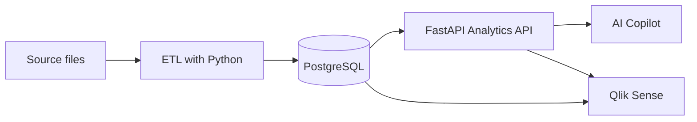

<div align="center">

# DataPilot

### BI & AI Copilot for trustworthy business insights

[](#roadmap)
[](https://www.python.org/)
[](https://fastapi.tiangolo.com/)
[](https://www.postgresql.org/)
[](https://www.qlik.com/)

A personal portfolio project that connects data engineering, analytics, APIs, BI and generative AI in one end-to-end solution.

</div>

> [!IMPORTANT]
> The LLM does not calculate business metrics. **SQL/Python is the source of truth; the LLM interprets and explains validated results.**

## Project status

| Item | Current state |
|---|---|
| Phase | Planning / initial development |
| Current sprint | Sprint 1 — Data Foundation |
| Current task | DATA-01 — Define Business Scenario |
| Method | Lightweight Scrum — 1-week sprints |
| Weekly dedication | Approximately 2–4 hours |
| Development | Renan + ChatGPT |

DataPilot has just started. This README documents the intended architecture and roadmap; it does not claim that every component is already implemented.

## Vision

Traditional dashboards are excellent for monitoring metrics, but users still need to interpret charts, investigate changes and translate data into decisions. DataPilot explores a complementary workflow:

```text
PostgreSQL → Python/FastAPI → Analytics → AI → Qlik Sense
```

The platform will centralize trusted business data, expose validated metrics through an API, visualize them in Qlik Sense and use an AI copilot to explain results in natural language.

## Core principles

- Business rules remain deterministic and auditable in SQL/Python.
- The AI layer receives validated metrics instead of calculating them.
- Each layer can evolve independently.
- The LLM provider is configurable through environment variables.
- Tests, documentation and reproducibility are part of the project—not afterthoughts.

## Planned architecture



## Technology stack

| Area | Technologies |
|---|---|
| Data and ETL | Python, Pandas, SQL |
| Database | PostgreSQL |
| API | FastAPI, SQLAlchemy, Pydantic |
| BI | Qlik Sense |
| AI | Provider-agnostic integration via `.env` |
| Quality | Pytest |
| Infrastructure | Docker |
| Version control | Git and GitHub |

The AI integration is designed to support providers such as Gemini, Groq or DeepSeek without coupling the business logic to one vendor.

## Roadmap

- [ ] **Sprint 1 — Data Foundation:** define the business scenario, source data and relational model
- [ ] **Sprint 2 — ETL + Qlik:** build the ingestion pipeline and initial dashboard
- [ ] **Sprint 3 — Analytics API:** expose validated KPIs through FastAPI — **no AI yet**
- [ ] **Sprint 4 — AI Copilot:** add natural-language interpretation over trusted API results
- [ ] **Sprint 5 — Automated Insights:** generate proactive, explainable business observations

## Repository structure

The structure will evolve as each sprint is implemented:

```text
DataPilot/
├── data/           # sample or development datasets
├── src/            # application and ETL source code
├── tests/          # automated tests
├── docs/           # architecture and project notes
├── .env.example    # configuration template
└── README.md
```

## Author

Built as a learning and portfolio project by [Renan Marques](https://github.com/Renanmrqs), combining his studies in software development with practical experience in BI, data and Qlik Sense.
