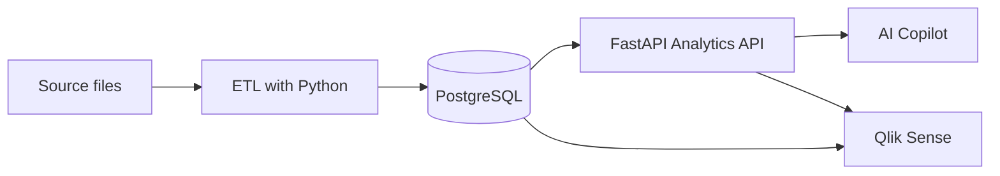

<div align="center">

# DataPilot

### BI & AI Copilot for trustworthy business insights

[](#roadmap)
[](https://www.python.org/)
[](https://fastapi.tiangolo.com/)
[](https://www.postgresql.org/)
[](https://www.qlik.com/)

A personal portfolio project that connects data engineering, analytics, APIs, BI and generative AI in one end-to-end solution.

</div>

> [!IMPORTANT]
> The LLM does not calculate business metrics. **SQL/Python is the source of truth; the LLM interprets and explains validated results.**

## Project status

| Item | Current state |
|---|---|
| Phase | Initial development |
| Current sprint | Sprint 1 — Data Foundation |
| Current task | Initial source data review completed; relational modeling next |
| Method | Lightweight Scrum — 1-week sprints |
| Weekly dedication | Approximately 2–4 hours |
| Development | Renan + ChatGPT |

The initial Sales ETL and source data review are complete. The database, API, dashboards and AI features below remain planned.

## Vision

Traditional dashboards are excellent for monitoring metrics, but users still need to interpret charts, investigate changes and translate data into decisions. DataPilot explores a complementary workflow:

```text
PostgreSQL → Python/FastAPI → Analytics → AI → Qlik Sense
```

The platform will centralize trusted business data, expose validated metrics through an API, visualize them in Qlik Sense and use an AI copilot to explain results in natural language.

## Core principles

- Business rules remain deterministic and auditable in SQL/Python.
- The AI layer receives validated metrics instead of calculating them.
- Each layer can evolve independently.
- The LLM provider is configurable through environment variables.
- Tests, documentation and reproducibility are part of the project—not afterthoughts.

## Planned architecture



## Planned technology stack

| Area | Technologies |
|---|---|
| Data and ETL | Python, Pandas, SQL |
| Database | PostgreSQL |
| API | FastAPI, SQLAlchemy, Pydantic |
| BI | Qlik Sense |
| AI | Provider-agnostic integration via `.env` |
| Quality | Pytest |
| Infrastructure | Docker |
| Version control | Git and GitHub |

The AI integration is designed to support providers such as Gemini, Groq or DeepSeek without coupling the business logic to one vendor.

## Roadmap

- [ ] **Sprint 1 — Data Foundation:** define the business scenario, source data and relational model
- [ ] **Sprint 2 — ETL + Qlik:** build the ingestion pipeline and initial dashboard
- [ ] **Sprint 3 — Analytics API:** expose validated KPIs through FastAPI — **no AI yet**
- [ ] **Sprint 4 — AI Copilot:** add natural-language interpretation over trusted API results
- [ ] **Sprint 5 — Automated Insights:** generate proactive, explainable business observations

## Repository structure

Current repository layout:

```text
DataPilot/
|-- data/
|   |-- raw/                    # original source CSVs
|   `-- processed/              # transformed Sales CSV
|-- scripts/                    # data inspection and validation scripts
|-- sql/                        # reserved for database definitions
|-- src/
|   `-- etl/transform_sales.py   # Sales transformation
|-- tests/                      # reserved for automated tests
|-- AGENTS.md                   # collaboration preferences
`-- readme.MD
```

## Current progress

- [x] Inspect all six source CSVs.
- [x] Convert Sales monetary values, discount percentages and date keys.
- [x] Save the transformed Sales dataset to `data/processed/sales.csv`.
- [x] Review Sales row counts, keys, dates and all five monetary columns.
- [x] Check discount conversion during development, including nonzero examples.
- [ ] Define the relational model and SQL schema.

### Source data review

| Dataset | Initial findings | Action |
|---|---|---|
| Sales | Monetary values and percentages stored as text; dates stored as numeric keys | Convert values and save a processed CSV |
| Product | Numeric costs and prices; unique, non-null ProductKey; 56 missing colors and 102 repeated SKU occurrences beyond the first | Preserve source values; no cleanup identified |
| Customer | 18,485 rows; unique, non-null CustomerKey; missing attributes only on the -1 record | Preserve the special record |
| Reseller | 702 rows; unique, non-null ResellerKey; missing attributes only on the -1 record | Preserve the special record |
| Sales-Territory | 11 rows; unique, non-null SalesTerritoryKey; no missing values | No cleanup identified |
| Sales-Order | 121,253 rows; unique, non-null SalesOrderLineKey; no missing values | No cleanup identified |

These are initial inspection findings, not a complete validation of business rules or relationships. Missing colors and repeated SKUs were preserved. The meaning of the Customer and Reseller `-1` records still needs to be documented from the source context.

## Data model outline

Sales is the fact table: each row represents a sales order item identified by `SalesOrderLineKey`.

| Related dataset | Join key in Sales | Intended relationship |
|---|---|---|
| Product | ProductKey | Many sales items to one product record |
| Customer | CustomerKey | Many sales items to one customer record |
| Reseller | ResellerKey | Many sales items to one reseller record |
| Sales-Territory | SalesTerritoryKey | Many sales items to one territory |
| Sales-Order | SalesOrderLineKey | One order item to one order detail record |

This outline will guide the SQL schema. Calendar is deferred to a later step.

## Local development

Run from the project root in PowerShell, using the existing virtual environment with pandas installed:

```powershell
# Inspect all original CSVs
.\.venv\Scripts\python.exe scripts/inspect_all_date.py

# Inspect Product
.\.venv\Scripts\python.exe scripts/inspect_product.py

# Transform and save Sales
.\.venv\Scripts\python.exe src/etl/transform_sales.py

# Review the saved Sales dataset against the original
.\.venv\Scripts\python.exe scripts/check_sales.py
```

The transformation preserves the original files and overwrites only `data/processed/sales.csv`. It removes currency symbols and thousands separators, converts percentages to fractions, and converts date keys to dates. Missing or invalid dates become missing values. Dates are saved as `YYYY-MM-DD`; CSV files do not retain pandas data types.

The current validation script prints row counts, missing and repeated keys, key order preservation, date checks and monetary differences. Results require review; the script does not yet enforce assertions. Discount checks were run during development but are not currently included in the saved script.

## Next steps

1. Document table grain, keys and relationships, then define the PostgreSQL schema in `sql/`.
2. Prepare a reproducible database setup and load the reviewed datasets.
3. Check relationships and reconcile row counts after loading.
4. Add the discount checks to the saved validation script and standardize existing code identifiers, comments and output messages in English.
5. Build initial SQL metrics and the first Qlik dashboard once the data foundation is ready.

The next session starts with the relational model. Calendar and AI integration remain later steps.

## Project language

README content, code identifiers, comments and console messages should be written in English. Existing scripts still contain some Portuguese text and will be standardized as they are updated. Learning discussions can remain in Portuguese.

## Author

Built as a learning and portfolio project by [Renan Marques](https://github.com/Renanmrqs), combining his studies in software development with practical experience in BI, data and Qlik Sense.
